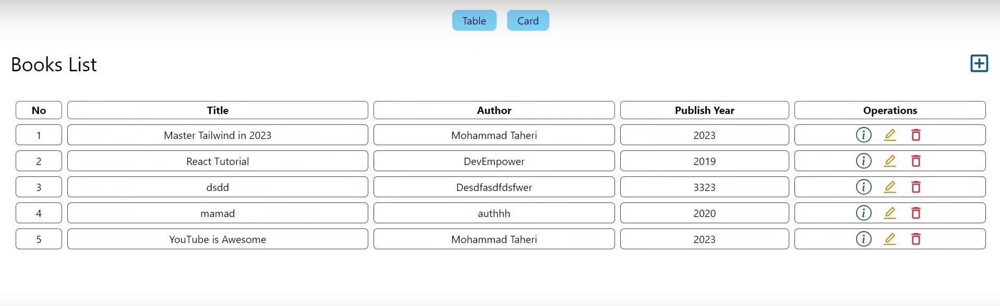

# Book Management System (MERN Stack)

This is a CRUD (Create, Read, Update, Delete) application built using the MERN stack (MongoDB, Express.js, React.js, Node.js) to manage book records. The application allows users to add, edit, and delete book entries, providing an intuitive interface for easy management of book titles, authors, and publish year.

## Features

- **Add Books**: Easily add new book records by entering the title, author, and publish year.
- **View Books**: View a list of all books with their corresponding details.
- **Edit Books**: Update existing book records with new information.
- **Delete Books**: Remove book records that are no longer needed.
- **Search Books**: Quickly search for books by title or author.
- **Responsive Design**: Designed to work on all devices, from desktop to mobile.
